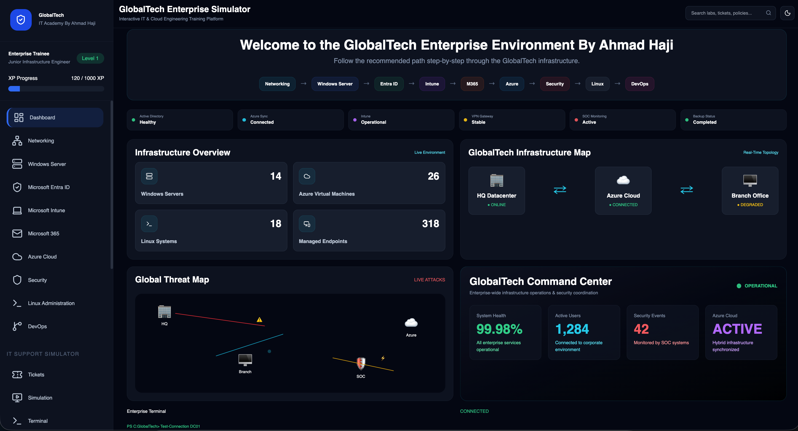
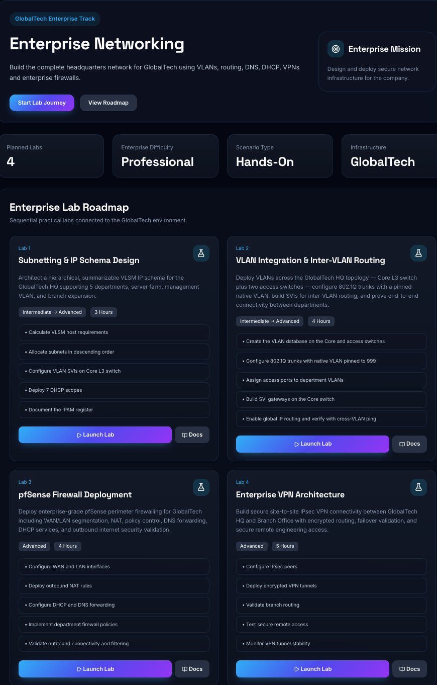
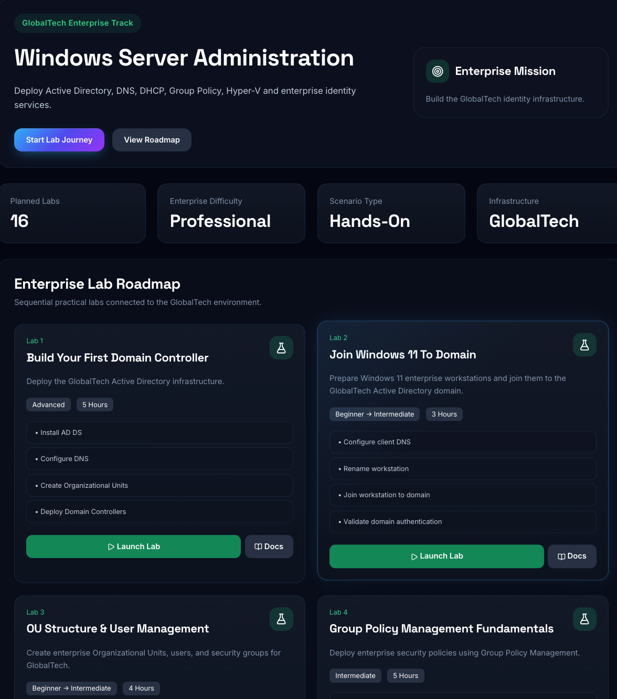
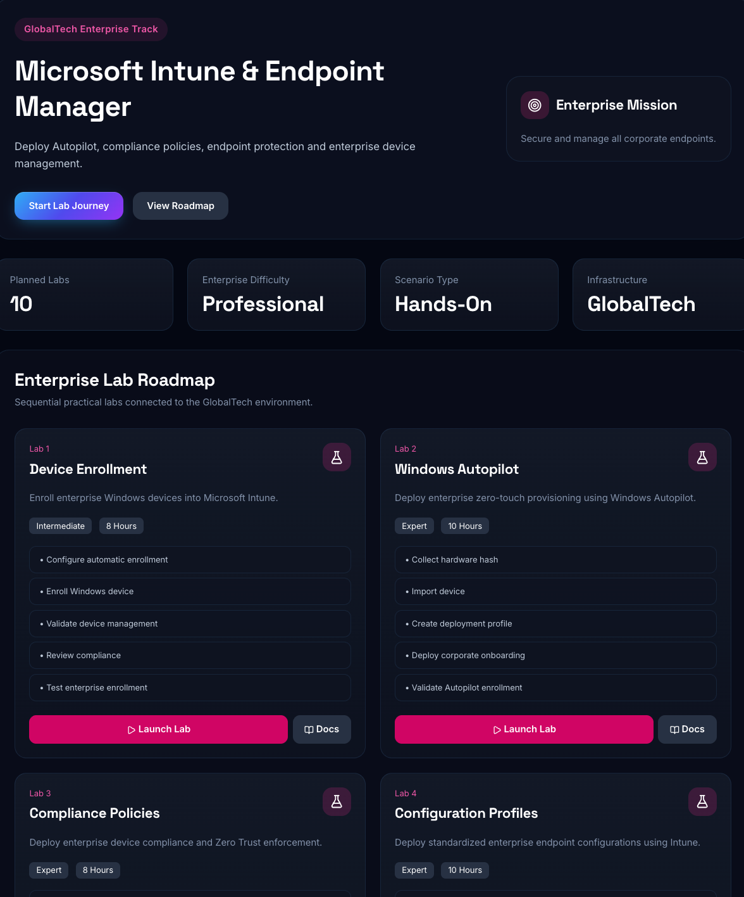
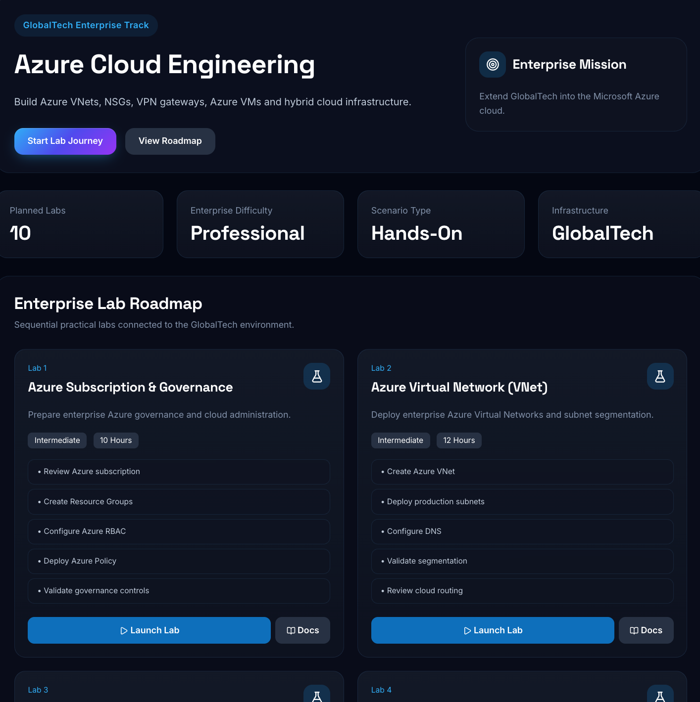
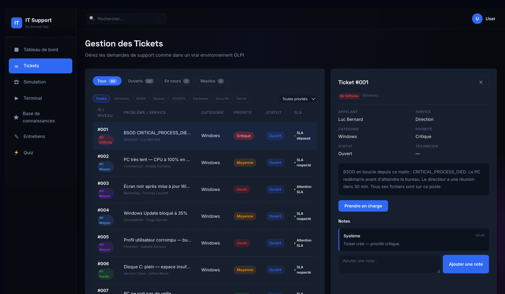
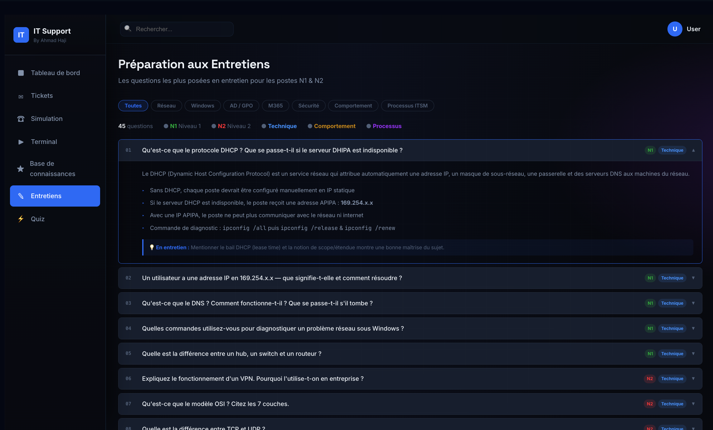

# GlobalTech Enterprise Simulator

> A modern enterprise IT infrastructure simulation platform focused on real-world System Administration, Cloud Engineering, Networking, Security and IT Operations.

**Live →** [ahmadhaji-hub.github.io/globaltech-it-simulator](https://ahmadhaji-hub.github.io/globaltech-it-simulator)

**Stack →** HTML · TailwindCSS · Vanilla JavaScript · GitHub Pages

**Theme →** Enterprise Dark Infrastructure UI.

---

# Overview

GlobalTech Enterprise Simulator is a hands-on enterprise IT engineering platform designed to simulate real-world infrastructure environments.

The platform includes:

* Enterprise networking labs
* Windows Server administration
* Microsoft 365 & Entra ID
* Microsoft Intune
* Azure Cloud engineering
* Security operations
* Linux administration
* DevOps infrastructure
* Interactive enterprise simulations
* Interview preparation
* Toolkits & automation


---

# Screenshots

## Dashboard



## Networking Track



## Windows Server



## Microsoft Intune



## Azure Cloud



## Suppurt Simulator



## Interview Simulator



---

# Features

| Feature                   | Description                               |
| ------------------------- | ----------------------------------------- |
| Enterprise Labs           | Real-world infrastructure deployment labs |
| XP & Progression          | Gamified enterprise learning system       |
| Interactive Roadmaps      | Structured enterprise lab progression     |
| Modal Documentation       | Step-by-step enterprise lab docs          |
| Networking Infrastructure | VLANs, VPNs, Routing, Firewalls           |
| Windows Server            | AD DS, GPO, DHCP, DNS                     |
| Entra ID & Intune         | Cloud identity & endpoint management      |
| Security Labs             | Hardening, SIEM, MFA, Defender            |
| Linux & DevOps            | Docker, CI/CD, Bash, Monitoring           |
| Interview Preparation     | Enterprise troubleshooting scenarios      |

---

# Enterprise Tracks

| Track                | Focus                             |
| -------------------- | --------------------------------- |
| Networking           | VLANs, Routing, VPN, Firewalls    |
| Windows Server       | AD DS, DNS, DHCP, GPO             |
| Microsoft Entra ID   | Identity & Access Management      |
| Microsoft Intune     | Endpoint Management               |
| Microsoft 365        | Exchange Online & Cloud Services  |
| Azure Cloud          | Virtual Machines & Infrastructure |
| Security             | Enterprise Security Operations    |
| Linux Administration | Linux Infrastructure              |
| DevOps               | CI/CD & Automation                |

---

# XP & Progression System

| Level   | Role                           |
| ------- | ------------------------------ |
| Level 1 | Enterprise Trainee             |
| Level 2 | Junior Infrastructure Engineer |
| Level 3 | Systems Administrator          |
| Level 4 | Cloud Engineer                 |
| Level 5 | Security Engineer              |
| Level 6 | Enterprise Architect           |

---

# Tech Stack

| Technology         | Usage                |
| ------------------ | -------------------- |
| HTML5              | Structure            |
| TailwindCSS        | Enterprise UI        |
| Vanilla JavaScript | Dynamic interactions |
| Lucide Icons       | Icon system          |
| GitHub Pages       | Hosting              |

---

# Project Structure

```plaintext
/
├── index.html
├── README.md
├── simulation/
├── img/
├── assets/
├── js/
├── css/
└── docs/
```

---
# Enterprise Learning Journey

The platform is structured as a real enterprise learning path:

Networking Fundamentals
→ Windows Server
→ Active Directory
→ Microsoft Entra ID
→ Intune
→ Microsoft 365
→ Azure Infrastructure
→ Security Operations
→ Linux Administration
→ DevOps Engineering

Each section contains sequential enterprise labs and structured documentation designed to simulate real-world infrastructure environments.


# Future Improvements

* Authentication System
* Firebase Integration
* Persistent XP Storage
* AI Assistant
* Ticketing Simulator
* Active Directory Simulation
* SIEM Dashboard
* Enterprise Monitoring

---

# Author

Built by  Ahmad Haji

GlobalTech Enterprise Simulator ©

## Open Source Integrations

- IT Support Simulator integration based on the open-source work of  Rogério Rocha
- https://github.com/rogeriorch77
